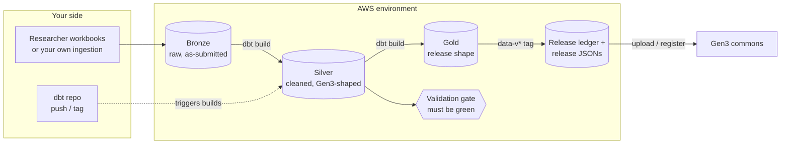

# Concepts — how the pipeline works and why

This doc explains the ideas behind the platform: what each piece is for, what
problem it solves, and what it lets you do. It contains no setup steps — when
you are ready to build something, [QUICKSTART.md](QUICKSTART.md) is the fastest
working deployment and [RUNBOOK.md](RUNBOOK.md) explains every step of that
same journey in detail.

It is written for a technical reader who has some AWS experience but has never
touched this platform (or Gen3). Every abbreviation is spelled out at first
use, and there is a [glossary](#glossary) at the end.

---

## 1. What this is, and the problem it solves

A [Gen3](https://gen3.org/) **data commons** is a web platform for sharing
research data — think of it as a catalogue plus a controlled-access download
service for a research programme's studies. A commons is only as useful as the
metadata behind it (which subjects exist, which samples belong to them, which
files describe which samples), and getting that metadata *in* is genuinely
hard:

- Researchers submit study metadata as spreadsheets, which must be checked
  against the commons' **data dictionary** — the schema that defines what a
  valid subject, sample, or file record looks like — before anything can be
  published.
- Raw submissions need cleaning and reshaping, while keeping the original,
  the cleaned version, and the published version separate and traceable.
- The portal must never see half-finished data: releases have to be
  versioned, validated snapshots, not whatever the tables happened to contain
  that day.
- Doing all this with ad-hoc scripts and manual uploads works exactly until
  the first mistake, and leaves no audit trail.

This repo deploys the automated alternative into your own AWS account: a
three-layer data warehouse with a hard validation gate and a tagged-release
workflow, so publishing data to a commons becomes a reviewed, repeatable
engineering process instead of a sequence of careful manual steps.

## 2. The moving parts

Five things cooperate. It helps to know from the start which is which,
because the setup guides have you create three of them:

| Part | What it is | Who owns it |
|---|---|---|
| **aws-gen3-pipeline** (this repo) | The infrastructure code — TypeScript definitions of every AWS resource, deployed with the AWS CDK | AustralianBioCommons; you never fork or edit it |
| **Your deployment wrapper** | A tiny *private* repo holding only your real config (account IDs, connection ARNs) and a pinned version of this repo | You (section 3) |
| **Your dbt repo** | The SQL transformations that build the warehouse, created from [gen3-dbt-template](https://github.com/AustralianBioCommons/gen3-dbt-template); pushing to it triggers builds | You |
| **`g3dt`, the operator CLI** | The [gen3-dataops-toolkit](https://pypi.org/project/gen3-dataops-toolkit/) command-line tool used for day-to-day operations | Installed on your laptop (and pre-installed on the job box) |
| **The AWS environment** | Everything the deploy creates: buckets, databases, build pipelines, the validation state machine, the job box | Your AWS account, one set per environment (`test`, `prod`, …) |

How data flows through the deployed environment:

A normal week, once deployed: a study team drops a metadata workbook in the
bronze bucket and an ingest job turns each sheet into a bronze table; an
engineer pushes model changes to the dbt repo and CI builds them in isolated
scratch databases; the validation state machine checks every generated record
against the data dictionary; someone tags the dbt repo `data-v1.2.0`, which
writes a versioned snapshot to the release ledger and produces the release
files the Gen3 deployment consumes; and anyone with access explores any layer
in Athena with plain SQL the whole time.

## 3. The deployment wrapper — deploy without forking

You never deploy from a clone or fork of this repo. Instead a script
(`init-wrapper.sh`) generates a small private repo of your own — the
**deployment wrapper** — containing only your per-environment config files,
any custom Glue job scripts, and a one-line file (`UPSTREAM_VERSION`) pinning
which released version of this repo to use. Its `deploy.sh` clones this repo
at that pinned version, overlays your config on top, and deploys.

Three properties fall out of that shape, and they are the whole point:

- **Your real IDs stay private.** AWS account numbers, connection ARNs and
  Gen3 domains are committed in the wrapper — a private repo — never in a
  public one. This is also why the wrapper must never be a *fork* of this
  repo: GitHub forks of public repositories cannot be made private.
- **You own no pipeline code, so you can never diverge.** Every deploy starts
  from a fresh clone of the upstream version you pinned. There is no copied
  stack code to drift out of date.
- **Upgrades are a version bump, not a merge.** Change one line in
  `UPSTREAM_VERSION`, review the diff, deploy. Rollback is reverting that
  line.

Mechanics and day-2 detail: [WRAPPER_GUIDE.md](WRAPPER_GUIDE.md).

## 4. Configuration: INPUTS, OUTPUTS, and what SSM achieves

There are exactly two kinds of value in this system, and the split is its
core design rule:

- **INPUTS** are the values a human chooses: your AWS account and region,
  your dbt repo, the facts about your Gen3 commons. They live in **one JSON
  file per environment** (`config/<project>.<env>.json`, in your wrapper) and
  nowhere else.
- **OUTPUTS** are every resource *name* the deploy creates — bucket names,
  database names, pipeline names. **Nobody ever authors these.** A single
  pure function (`deriveNames()` in `lib/names.ts`) derives them all from
  your project and environment name.

Where do the derived names go? Into **SSM Parameter Store** — an AWS service
that is essentially a managed key-value tree your account's tools can read.
(SSM stands for "Systems Manager"; Parameter Store is one of its features.)
On every deploy the pipeline publishes each derived name to a parameter under
`/<project>/<env>/...`.

What that achieves is the payoff of the whole design: **every runtime
consumer — the `g3dt` CLI, the build pipelines, the job box, every Glue job —
looks names up in SSM instead of having them typed in.** Nothing takes a
bucket or database name as an argument, so:

- Nobody ever types a bucket name twice, so names cannot drift apart.
- One toolkit version serves every project and environment — point your AWS
  profile at a different account and `g3dt` resolves that environment's names
  automatically.
- If a command touches an unexpected resource, the config is wrong, not the
  code. `g3dt config show --env <env>` prints everything resolved; read it
  before assuming a bug.

### The naming scheme and the SSM tree

The derived names follow three patterns (pinned by `test/names.test.ts` —
changing them is a breaking change for every SSM consumer):

| Resource class | Pattern | Example |
|---|---|---|
| S3 buckets | `<project>-<env>-<suffix>-<account-id>-<region>` | `etl-test-metadata-123456789012-ap-southeast-2` |
| Glue databases | `<project>_<env>_<suffix>_db` | `etl_test_silver_db` |
| Everything else | `<project>-<env>-<suffix>` | `etl-test-dbt-test-and-run` |

The SSM tree per environment holds: `meta/*`, `buckets/*`, `glue/db/*`,
`athena/*`, `release/*`, `roles/*`, `codebuild/*`, `codepipeline/*`,
`stepfunctions/*`, `ec2/*`, plus the `app/*` Gen3 facts mirrored for the CLI.
Two guards keep it honest: `test/ssm-publishing.test.ts` fails the build if a
named resource has no matching parameter, and `g3dt config diff` compares
live SSM against your committed config at runtime (it exits non-zero on
drift, so it can gate CI).

## 5. The medallion layers and the data contract

The warehouse follows the **medallion architecture** — an industry pattern of
three progressively-refined layers, here with precise meanings:

| Layer | Contains | Built by |
|---|---|---|
| **Bronze** | Raw data exactly as submitted, with provenance columns on every row | **You** — any ingestion you like |
| **Silver** | Cleaned data reshaped to what Gen3 expects: one table per Gen3 node type | dbt |
| **Gold** | The release and export shape — silver plus things only known at release time (e.g. file-download IDs from indexd) | dbt |

Each layer is an S3 bucket plus a Glue database of **Iceberg** tables.
(Apache Iceberg is a table format over S3 files that adds what a database
gives you — transactions, schema evolution, and named **snapshots** of a
table at a point in time. The snapshots matter later, in section 8.)

The platform is deliberately **unopinionated about ingestion and opinionated
about what comes out of it**. The contract is only three requirements:

1. **Raw data lands in bronze** — however you get it there. The supported
   no-code path is metadata-template workbooks dropped in S3, but a Glue job,
   a Lambda, or a manual upload all count. Bronze is an *input* to the
   platform, not a product of it — dbt never writes it, and that boundary is
   enforced by IAM, not convention.
2. **Silver is built by dbt and is Gen3-shaped** — one model per Gen3 node,
   named `silver_<study>_<node>`. This is the layer where "our data" becomes
   "a Gen3 submission". The naming is load-bearing: everything downstream
   discovers work by parsing those names.
3. **Validation runs off silver** (section 7).

Everything beyond the contract is recommendation, written down in
[DATA_LAYERS.md](DATA_LAYERS.md) so you do not have to rediscover the shape
that worked.

## 6. CI builds vs release builds — why they never touch

Two build pipelines watch your dbt repo, and they deliberately write to
different places:

- **Every commit** triggers the CI pipeline, which runs `dbt build` into
  isolated scratch databases prefixed `ci_` (e.g. `ci_<project>_<env>_silver_db`)
  — never the real warehouse.
- **Only a `data-v*` tag** triggers the release pipeline, which builds into
  the real warehouse and records the release (section 8).

The isolation exists because sharing databases caused two real problems:
concurrent builds racing each other on the same tables, and — more subtly —
every CI run advancing the warehouse tables' Iceberg snapshots, which
eventually expires the old snapshots that past releases were pinned to,
silently destroying their reproducibility. With CI isolated, warehouse
snapshots advance only at release time, so the pins stay valid.

(There is no `ci_` bronze database — bronze is never rebuilt by dbt, so it
needs no scratch copy.)

## 7. The validation gate — what green means

Before data is released, the validation **Step Function** (an AWS service for
running multi-step workflows as state machines) answers one question per
record: *would Gen3 accept this?* It discovers studies from silver table
names, dumps every table to Gen3-shaped JSON, validates each record against
the data dictionary, and writes results to a queryable table.

The design choice that matters: **if real errors remain, the run fails.** A
warning would have been ignored; a failure means a green run carries
information. Green = every record is schema-clean and the release can go out.
Red = query the results table for the latest run, fix the data or the models,
rebuild, re-run.

Note what validation is *not*: a linter over your source data. If silver is
not yet Gen3-shaped, the failures will describe schema violations, not the
modelling problem that caused them.

## 8. Releases, tags, and reproducibility

Two independent lifecycles run over the platform, and they are deliberately
decoupled:

- **Software releases** (`v*` tags on *this* repo and the toolkit) ship code.
  You consume them by bumping the pins in your wrapper.
- **Data releases** (`data-v*` tags on *your dbt repo*) ship a versioned
  snapshot of the warehouse. A data release needs no code change, and vice
  versa.

Cutting a data release is one `git tag data-v1.2.0 && git push` — never a
console click. The release pipeline rebuilds the warehouse, then writes one
row per model to a release **ledger** table, recording the exact Iceberg
snapshot ID each model was built from. The export step then reads *those
snapshots* — not "the current table" — which is what makes a release
reproducible months later even after the tables have moved on. Finally it
emits one JSON file per Gen3 node into a versioned folder in the gold bucket:
the artifact a Gen3 deployment actually consumes. Rolling back is pointing at
the previous version's folder.

## 9. The job box and the credential model

Long-running operations (uploading metadata to the commons, registering
files) should not depend on a laptop staying awake, so each environment has a
**job box**: a small EC2 instance that `g3dt <command> --on ec2` dispatches
work to. Three design points worth knowing:

- **Dispatch uses SSM Run Command, not SSH.** The box polls *outward* to
  AWS; nothing ever connects in, so it needs zero open inbound ports. Jobs
  survive your laptop disconnecting, and you watch them with
  `g3dt jobs logs <run-id> --follow`.
- **There is no repo on the box to drift.** It runs the pip-installed toolkit
  version pinned in your config (`toolkitVersion`), nothing else. Any
  confirmation prompt is answered on your laptop *before* dispatch.
- **It stops itself.** A CloudWatch alarm stops the box after ~24 hours of
  idling, so a forgotten box costs a day, not a month.

The credential model is equally deliberate: **your AWS profile is the
environment selector.** An environment name selects an SSM tree; the
environment's stored Gen3 API key selects the commons. There is no URL for an
operator to pass — and therefore none to get wrong.

## 10. Networking, in brief

The pipeline creates its own VPC (Virtual Private Cloud — an isolated network
in your AWS account) and borrows nothing: a private subnet, one NAT gateway
for outbound internet, and security groups with zero inbound rules. Only two
components attach to it (the job box and the build projects); Glue jobs
deliberately run without a VPC in Glue's own managed network, which keeps
their internet access simple. If your Gen3 commons' API is internal-only —
common in production — the config supports peering into the Gen3 VPC instead
of going over the public internet.

Full detail, including the design decisions and what the topology blocks:
[VPC_NETWORKING.md](VPC_NETWORKING.md).

## Glossary

| Term | What it means here |
|---|---|
| **Gen3 / data commons** | An open-source platform for sharing research data. A "commons" is one deployed instance, with a portal, an API, and controlled-access downloads. |
| **Data dictionary** | The Gen3 schema: definitions of every node type (subject, sample, file, …), their properties, and how they link. Validation checks records against it. |
| **Node** | One record type in the dictionary (e.g. `case`, `demographic`). Silver has one table per node per study. |
| **CDK (Cloud Development Kit)** | AWS framework for defining cloud infrastructure in code (TypeScript here) instead of console clicks. |
| **Stack** | A CDK deployable unit — one group of related resources (this pipeline deploys twelve). |
| **CloudFormation** | The AWS service CDK compiles down to; it creates/updates the actual resources. |
| **SSM Parameter Store** | A managed key-value tree in AWS (part of Systems Manager). This pipeline publishes every derived resource name there; all tooling reads names from it. |
| **SSM Run Command** | Another Systems Manager feature: run a command on an EC2 instance via the AWS API, no SSH needed. How `g3dt` dispatches jobs to the box. |
| **S3** | AWS object storage — where all data files live. |
| **Glue** | AWS managed ETL service. Used here for **Glue jobs** (Python scripts run serverlessly) and the **Glue Data Catalog** (the registry of databases and tables that Athena queries). |
| **Athena** | Serverless SQL engine that queries data directly in S3, via the Glue catalog. dbt runs its SQL through Athena. |
| **Athena workgroup** | A named query environment in Athena (isolates query history and result locations per project/env). |
| **Iceberg** | Apache Iceberg, a table format over S3 that adds transactions, schema evolution, and point-in-time **snapshots**. Releases pin snapshot IDs. |
| **dbt (data build tool)** | Open-source tool that compiles templated SQL models and runs them in order against a query engine. Your dbt repo defines silver and gold. |
| **Medallion architecture** | The bronze (raw) → silver (cleaned) → gold (publishable) layering pattern. |
| **CodePipeline / CodeBuild** | AWS CI/CD services: CodePipeline defines the stages, CodeBuild runs the build commands (here, `dbt build`). |
| **CodeConnections** | AWS-managed OAuth link between an AWS account and GitHub (formerly "CodeStar Connections"), letting CodePipeline watch your private dbt repo with no stored token. |
| **Step Functions** | AWS service for orchestrating multi-step workflows as state machines. Runs validation and the release export. |
| **IAM** | Identity and Access Management — AWS permissions. Layer boundaries (e.g. "dbt cannot write bronze") are enforced with it. |
| **SSO / IAM Identity Center** | AWS single sign-on; you log in once per day per profile with `aws sso login`. |
| **VPC** | Virtual Private Cloud, an isolated network in your account. |
| **indexd** | Gen3's file registry service: maps a file's identity (`object_id`/GUID) to its storage locations, enabling controlled downloads. |
| **DRS** | GA4GH Data Repository Service — the standard API through which registered files are resolved and downloaded (indexd speaks it). |
| **Deployment wrapper** | Your tiny private repo of config + pinned upstream version, from which all deploys run (section 3). |
| **`g3dt`** | The `gen3-dataops-toolkit` CLI — the operator's day-to-day tool. Resolves everything from SSM. |
| **`g3mt`** | The `gen3-metadata-templates` CLI — generates the Excel workbooks researchers fill in. |
| **CI build vs release build** | Commit-triggered build into `ci_` scratch databases vs `data-v*`-tag-triggered build into the real warehouse (section 6). |

---

Next: [QUICKSTART.md](QUICKSTART.md) to stand one up with minimal ceremony,
or [RUNBOOK.md](RUNBOOK.md) for the same journey with every step explained.
