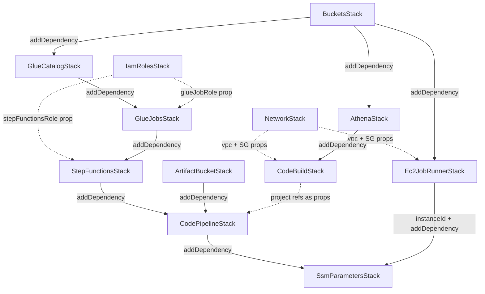

# Gen3 AWS Data Pipeline: Developer Guide

Welcome to the **Gen3 AWS Data Pipeline** project! This guide is designed to help you understand, run, and extend this infrastructure-as-code (IaC) project. Whether you are a new joiner or a seasoned developer, this document will walk you through the codebase, explain how the pieces fit together, and show you how to perform common tasks.

---

## Key Terms

New to AWS or data engineering? The full glossary — CDK, stacks,
CloudFormation, S3, Glue, Athena, dbt, Step Functions, SSM, Iceberg,
medallion architecture, indexd, and the rest — lives in
[CONCEPTS.md](CONCEPTS.md#glossary), alongside a plain-language explanation
of how the whole system fits together. Read that first; this guide assumes
those terms from here on. (One term specific to this guide: a **Construct**
is a CDK building block — a Stack is made up of Constructs, e.g. an S3
bucket or a Glue job.)

---

## Project Structure

```
aws-gen3-pipeline/
├── bin/
│   └── app.ts                  # Thin CDK entry point
├── lib/
│   ├── config.ts               # InputConfig — the INPUTS a human authors
│   ├── names.ts                # deriveNames() — every OUTPUT name, derived
│   ├── load-config.ts          # Resolves config from -c env=<name> / context / env var
│   ├── build-app.ts            # Wires all stacks together (used by app + tests)
│   └── stacks/                 # One file per CDK stack
│       ├── artifact-bucket-stack.ts
│       ├── athena-stack.ts
│       ├── buckets-stack.ts
│       ├── codebuild-stack.ts
│       ├── codepipeline-stack.ts
│       ├── ec2-job-runner-stack.ts
│       ├── glue-catalog-stack.ts
│       ├── glue-jobs-stack.ts
│       ├── iam-roles-stack.ts
│       ├── network-stack.ts
│       ├── ssm-parameters-stack.ts
│       └── stepfunctions-stack.ts
├── config/
│   └── <project>.<env>.json    # Per-env INPUTS (gitignored — start from docs/example-config.json)
├── test/                       # Jest unit tests
├── docs/                       # Documentation (you are here)
├── cdk.json                    # CDK toolkit configuration
├── package.json                # Node.js dependencies & scripts
└── tsconfig.json               # TypeScript compiler settings
```

> **Tip**: Start by reading `bin/app.ts` — it is the "main" file that instantiates every stack and wires them together. From there, follow the imports into `lib/stacks/` to see each stack's implementation.

---

## 1. What is this project?

This project uses **AWS CDK (Cloud Development Kit)** with **TypeScript** to deploy a complete serverless data pipeline on AWS.

### The Objective
The primary goal of this pipeline is to **produce validated, versioned data releases**. Unlike a standard ETL pipeline, this system enforces strict adherence to a schema contract before data is "released" to downstream consumers.

**High-Level Workflow:**
1.  **Transform**: dbt builds "Silver" tables from raw sources.
2.  **Validate**: Glue jobs export these tables to JSON and run a **custom software package** to validate them against strict JSON schemas. Results are recorded in the `validation` database.
3.  **Release**: When a `data-v*` tag is pushed to the dbt repo, a dedicated CodePipeline builds the models, generates "Gold" level JSONs, and records the release in the `releases` Iceberg ledger in the `metadata` database (branch pushes run CI only).

This ensures that the data lake is not just a swamp of files, but a versioned repository of high-quality, validated data products.

### Key Capabilities:
- **Data Lake Storage**: Automatically provisions S3 buckets for different data layers (Bronze, Silver, Gold).
- **Data Catalog**: Sets up AWS Glue Data Catalog databases to organize your data.
- **Data Processing**: Deploys AWS Glue Jobs (Python Shell) to run ETL scripts.
- **Orchestration**: Uses AWS Step Functions to coordinate complex workflows (e.g., run Job A, then Job B).
- **Interactive Querying**: Configures AWS Athena for SQL-based analysis.
- **CI/CD**: Sets up AWS CodePipeline and CodeBuild to automatically test and deploy your data transformations (e.g., dbt models).

---

## 2. Data Architecture & Strategy

This project implements a **"Medallion" Data Lake Architecture**, enforcing a strict flow of data from raw ingestion to refined business intelligence.

### The Layers (Bronze, Silver, Gold)
1.  **Bronze Layer (Raw Ingestion)**:
    -   **State**: Immutable / Append-only.
    -   **Source**: External data ingestion processes write here.
    -   **Access**: This pipeline treats the Bronze layer as a **Read-Only Source**. We do not modify data here; we only read from it.
2.  **Silver Layer (Cleaned/Conformed)**:
    -   **State**: Managed by dbt.
    -   **Purpose**: Data is cleaned, standardized, and joined.
    -   **Access**: The pipeline (via dbt) has full **Read/Write** access to create tables and overwrite partitions.
3.  **Gold Layer (Release and Export Shape)**:
    -   **State**: Managed by dbt.
    -   **Purpose**: What gets exported to release JSONs and uploaded to Gen3 — silver plus the things only known at release time (e.g. indexd `object_id` joins). See [DATA_LAYERS.md](DATA_LAYERS.md).
    -   **Access**: Full **Read/Write** access.

### The Execution Engine: AWS Athena
Unlike traditional ETL which might use Spark (Glue ETL), this pipeline primarily uses **SQL-based transformations** via **AWS Athena**.
-   **dbt (Data Build Tool)** acts as the orchestrator.
-   It compiles your SQL models (Jinja templates).
-   It submits these queries to **Athena**.
-   Athena executes the query (Serverless Presto) and writes the results (Parquet) to the appropriate S3 bucket (Silver or Gold).
-   This "ELT" (Extract, Load, Transform) pattern allows us to leverage the massive scalability of S3 and Athena without managing servers.

### The Validation & Release Lifecycle
Beyond standard transformations, this pipeline enforces strict quality gates and versioning:

1.  **Validation Workflow (Silver Layer)**:
    -   Once dbt builds the **Silver** tables, Glue jobs export them to JSON (concurrently — a bounded thread pool per job, tunable via `VALIDATION_EXPORT_MAX_WORKERS`).
    -   A specialized Glue job uses our custom software package to validate these JSONs against a strict schema, then runs a **validation gate**: it queries the run's results for real failures (known-noise patterns and synthetic studies excluded) and **fails the job — and the validation Step Function — if any remain**. A green validation run therefore means schema-clean data, not just that the machinery ran. Operator loop: gate fails → query the results table at the latest `validation_id` → fix the source data → re-run until green.
    -   **Two targets, one pair of jobs**: both Glue jobs take `--DB_TARGET` (`real` | `ci`, default `real`), supplied as a Glue job Argument by whichever Step Function invoked them. `ci` reads `ci_<…>_silver_db` and writes `ci_full_validation_results` under the `ci_validation/` S3 prefix; `real` reads the real silver DB and writes `full_validation_results` under `validation/`. The CI pipeline drives the `-ci` machine so it grades the build it just produced; runbook step 9 drives the real one. Keep the `DB_TARGETS` block identical in both scripts — Glue python-shell jobs get one file each, so it cannot be shared.
    -   **Results**: Validation outcomes are written to the `validation` database (Data Catalog) in a single batched Iceberg INSERT. This allows us to query and audit data quality issues via Athena. The results table is created by that first write (see GlueCatalogStack below on why no Glue table is defined in CDK); with no studies to validate, the job logs `NOTHING TO VALIDATE` and skips the gate rather than querying a table that does not exist.
    -   **Dependency pinning**: the Glue jobs install the toolkit with its heavy transitive deps pinned (`glue-jobs-stack.ts`) — a bare package pin was observed to cost ~20 minutes of pip resolver backtracking per job start.

2.  **Release Management (Gold Layer)**:
    -   **Trigger**: A `data-v*` tag push on the dbt repo triggers a dedicated CodePipeline (`dbtWriteReleaseInfoPipeline`); plain branch pushes never cut a release.
    -   **Build**: The pipeline builds the dbt models and generates **Gold** level models in JSON format.
    -   **Publish**: It writes release metadata to a `releases` table in the `metadata` database (Data Catalog), creating a permanent, versioned record of the data snapshot.

---

## 3. Getting Started

> **Setting up from scratch?** [RUNBOOK.md](RUNBOOK.md) is the step-by-step
> on-ramp (tool installs, AWS SSO, deploy-to-verified, the `g3dt` CLI, first
> data release); this section covers the contributor-side mechanics.

### Prerequisites
Before you begin, ensure you have the following installed:
- **Node.js** (current LTS)
- **AWS CLI** (configured with `aws configure`)
- **Git**

> **Note**: TypeScript and the CDK CLI are installed as project dev-dependencies (via `npm install`). You do **not** need to install them globally.

### Installation
1. Clone the repository:
   ```bash
   git clone <repo-url>
   cd aws-gen3-pipeline
   ```
2. Install dependencies:
   ```bash
   npm install
   ```
3. Verify the setup compiles:
   ```bash
   npm run build
   ```
   This runs the TypeScript compiler (`tsc`). If it succeeds with no errors, you are good to go.

### Running Tests

The project uses **Jest** for unit tests:
```bash
npm test
```
> The suite is load-bearing: `test/names.test.ts` (naming pins), `test/ssm-publishing.test.ts` (SSM drift guard), `test/load-config.test.ts` (config precedence), `test/dbt-trigger.test.ts` (release-trigger + CodeBuild env-var contract). As you add features, add corresponding tests.

### Configuration — INPUTS vs OUTPUTS

> **Writing a config file?** Use the step-by-step [Config Guide](CONFIG_GUIDE.md) —
> it documents every field, where to find its value, and how to validate the result.

There are exactly two kinds of values, and the split is the core design rule of this
repo (the reasoning and what SSM buys us:
[CONCEPTS.md section 4](CONCEPTS.md#4-configuration-inputs-outputs-and-what-ssm-achieves)):

- **INPUTS** — values a human chooses. They live in one file per environment,
  `config/<project>.<env>.json` (e.g. `config/myproject.test.json`). `config/*.json` is
  **gitignored** in this public template: `docs/example-config.json` is the starting
  template, and real configs live in a private deployment wrapper (see
  [WRAPPER_GUIDE.md](WRAPPER_GUIDE.md)). The schema is defined
  by `InputConfig` in `lib/config.ts`: identity (`projectId`, `environment`, `accountId`,
  `region`), an optional VPC CIDR (`network.vpcCidr` — the pipeline **creates its own
  VPC**), the GitHub connection (`repo.*`), the job box
  (`ec2.{instanceType, ami, keyName?}`), the `toolkitVersion` pin, and the Gen3 facts
  (`gen3.*`).
- **OUTPUTS** — names the CDK *creates* (buckets, Glue DBs, jobs, workgroup, pipelines,
  state machines). **Nobody authors these.** They are computed by `deriveNames()` in
  `lib/names.ts` — one pure, unit-tested function — and published to SSM Parameter Store
  under `/{project}/{env}/…` on deploy, where every runtime consumer reads them.

A complete input file (see `docs/example-config.json` for the annotated template):

```json
{
  "projectId": "myproject",
  "environment": "test",
  "accountId": "123456789012",
  "region": "ap-southeast-2",
  "network": {
    "vpcCidr": "10.20.0.0/16",
    "gen3ApiAccess": { "mode": "public" }
  },
  "repo": {
    "fullName": "org/repo-name",
    "branch": "main",
    "codeStarConnectionArn": "arn:aws:codeconnections:..."
  },
  "ec2": {
    "instanceType": "t3.micro",
    "ami": "ami-00000000000000000"
  },
  "toolkitVersion": "3.2.0",
  "gen3": {
    "dictionaryVersion": "v1.1.6",
    "awsSecretName": "myproject_test_gen3_api_key.json",
    "schemaS3Uri": "my-schema-bucket/schema.json",
    "domain": "test.commons.example.org",
    "appName": "testgen3",
    "namespace": "myproject",
    "clusterName": "Gen3-Eks-pipeline-test",
    "schemaRepo": "my-org/my-schema-repo"
  }
}
```

Notes:
- `ec2.keyName` is optional break-glass SSH; normal operation is SSM-only.
- If you find yourself adding a resource *name* to this file, stop — it belongs in
  `deriveNames()`.

### Loading the Config

`lib/load-config.ts` resolves the config in precedence order:

1.  **By env name** (the normal operator workflow — reads `config/<projectId>.<env>.json`, located by its `.<env>.json` suffix):
    ```bash
    npx cdk synth -c env=test
    ```
2.  **CDK Context** (inline JSON):
    ```bash
    npx cdk synth -c pipelineConfig="$(cat config/myproject.test.json)"
    ```
3.  **Environment variable** (how CI or another repo hands the CDK a config file):
    ```bash
    export PIPELINE_CONFIG_JSON="$(cat config/myproject.test.json)"
    npx cdk synth
    ```

---

## 4. Architecture & Stacks Overview

The project is split into multiple "Stacks" (defined in `lib/stacks/`). Each stack is responsible for a logical grouping of AWS resources. Here is how they flow together:



> **Reading the diagram**: Solid arrows (`-->`) represent explicit `addDependency()` calls in `lib/build-app.ts`. Dotted arrows (`-.->`) represent data passed via props (e.g., an IAM role) without a formal CDK dependency. `SsmParametersStack` actually depends on **every** other stack (only two edges are drawn) — it deploys last so no name is published before its resource exists.

### Stack Breakdown

0.  **NetworkStack** (`lib/stacks/network-stack.ts`):
    -   **Purpose**: The pipeline's own standalone network — nothing is borrowed from other stacks in the account.
    -   **Resources**: A VPC (CIDR from `network.vpcCidr`, default 10.20.0.0/16) with public + private subnets across 2 AZs, **one NAT gateway**, a free **S3 gateway endpoint**, and two **zero-ingress** security groups (job box, CodeBuild) with HTTPS-only egress.
    -   **Key Detail**: See `docs/VPC_NETWORKING.md` for the full design rationale, what it enables/blocks, and security posture.

1.  **BucketsStack** (`lib/stacks/buckets-stack.ts`):
    -   **Purpose**: Creates the S3 buckets.
    -   **Resources**: Raw Bronze, Silver, Gold, Metadata, Validation, and Athena Results buckets.
    -   **Why separate?**: Keeps storage persistence separate from compute.

2.  **Ec2JobRunnerStack** (`lib/stacks/ec2-job-runner-stack.ts`):
    -   **Purpose**: The long-job box the data-ops CLI dispatches work to via SSM Run Command — one instance **per environment**.
    -   **Resources**: EC2 instance (SSM-managed, no SSH), its IAM instance role, and the `/{project}/{env}/ec2/jobs` CloudWatch log group.
    -   **Key Detail**: user-data pip-installs the pinned toolkit and writes the `g3dt` marker (file + env vars), so the box self-configures from SSM.

3.  **IamRolesStack** (`lib/stacks/iam-roles-stack.ts`):
    -   **Purpose**: Centralizes IAM Role creation for core pipeline services.
    -   **Resources**: Roles for Glue Jobs and Step Functions. (**Note**: The CodeBuild role is created separately inside `CodeBuildStack`, not here.)
    -   **Key Detail**: It grants these roles permissions to access the S3 buckets and Glue catalog.

4.  **GlueCatalogStack** (`lib/stacks/glue-catalog-stack.ts`):
    -   **Purpose**: Defines the schematic structure of your data.
    -   **Resources**: Seven Glue Databases — the five real ones (`bronze`, `silver`, `gold`, `metadata`, `validation`), each pointing to its respective S3 bucket, plus two **CI isolation** databases (`ci_<project>_<env>_silver_db`, `ci_<project>_<env>_gold_db`, data under the same buckets' `dbt_ci/` prefix). Only the dbt template's `ci` target writes the CI databases — the real names are never prefixed — so commit-triggered CI builds can never advance the warehouse's Iceberg snapshots that releases pin.
    -   **Databases only, never tables**: no Glue table is defined in CDK anywhere. Iceberg tables cannot be meaningfully seeded by CloudFormation — a plain `CfnTable` entry makes Athena's Iceberg engine fail with "Cannot find or access the specified table" (observed live 2026-07-15). The `releases` ledger is created idempotently by `g3dt release write`, and `full_validation_results` / `ci_full_validation_results` by the validator's first write. All of their names are still published to SSM.

5.  **GlueJobsStack** (`lib/stacks/glue-jobs-stack.ts`):
    -   **Purpose**: Defines the ETL scripts to run.
    -   **Resources**: AWS Glue Jobs (Python Shell), deliberately **without** a VPC connection — connection-less python-shell jobs run on Glue's managed network, which already has internet access for pip and public endpoints (see `docs/VPC_NETWORKING.md`).
    -   **Configuration**: Iterates `names.glueJobs` from `deriveNames()` — each entry has a stable `key`, an env-prefixed `name`, and a `scriptLocation` under the metadata bucket. The toolkit pin comes from `config.toolkitVersion`.

6.  **StepFunctionsStack** (`lib/stacks/stepfunctions-stack.ts`):
    -   **Purpose**: Orchestrates the order of execution.
    -   **Resources**: Two State Machines:
        -   **ValidationStateMachine**: Runs `Write Validation JSONs` → `Silver Json Gen3_Validator` sequentially.
        -   **WriteReleaseJsonsStateMachine**: Runs the `write_data_release_to_json` Glue job.

7.  **AthenaStack** (`lib/stacks/athena-stack.ts`):
    -   **Purpose**: Sets up the query engine.
    -   **Resources**: Athena Workgroup configured to save results to the `athenaResults` bucket.

8.  **ArtifactBucketStack** (`lib/stacks/artifact-bucket-stack.ts`):
    -   **Purpose**: Creates the S3 bucket used by CodePipeline to store build artifacts.
    -   **Resources**: A single S3 bucket named `names.buckets.artifact`.

9.  **CodeBuildStack** (`lib/stacks/codebuild-stack.ts`):
    -   **Purpose**: CI/CD build projects for data transformations (dbt).
    -   **Resources**: Two CodeBuild projects (`dbt-test-and-run`, `dbt-release-builder`); buildspec paths are constants in the stack (facts about the source repo layout).
    -   **Key Detail**: Both projects run inside the VPC. This stack also creates its own `CodeBuildRole` with S3 and CloudWatch Logs permissions.

10. **CodePipelineStack** (`lib/stacks/codepipeline-stack.ts`):
    -   **Purpose**: Orchestrates the end-to-end CI/CD flow.
    -   **Resources**: Two CodePipelines:
        -   `dbtTestAndRunPipeline` — Source (GitHub via CodeStar) → Build (dbt test & run) → Invoke Validation Step Function.
        -   `dbtWriteReleaseInfoPipeline` — Source (GitHub via CodeStar) → Build (release builder) → Invoke Write Release JSONs Step Function.
    -   **Key Detail**: `dbtTestAndRunPipeline` triggers on branch pushes (CI); `dbtWriteReleaseInfoPipeline` triggers ONLY on `data-v*` tag pushes (a V2 git-tag trigger, pinned by `test/dbt-trigger.test.ts`). Both source via a CodeConnections connection.

11. **SsmParametersStack** (`lib/stacks/ssm-parameters-stack.ts`):
    -   **Purpose**: Publishes every OUTPUT name (plus the `app/*` Gen3 facts) to SSM Parameter Store under `/{project}/{env}/…` — the runtime source of truth for the CLI, CodeBuild, the EC2 box and Glue.
    -   **Resources**: 43 `StringParameter`s per environment on a stock config — 45 with the optional `llm` block (the final tree entry, `ec2/instanceId`, is published by `Ec2JobRunnerStack` itself — a cross-stack token would block instance replacement). Includes `glue/db/ciSilver` / `glue/db/ciGold`, the CI-isolation database names.
    -   **Key Detail**: Deploys **last** (`addDependency` on every other stack) so no name is published before its resource exists. `test/ssm-publishing.test.ts` fails if a named resource has no matching parameter.
    -   **Where the list lives**: `lib/ssm-keys.ts`, not the stack. That one map is read by the stack (to publish), by `test/ssm-publishing.test.ts` (to assert the synth matches it exactly), and by `scripts/integration_test.sh` (to probe a deployed tree key by key). **To add a parameter, add it to the map — nothing else needs editing, and no count needs bumping.** Key strings feed the logical ID (`P-<key with / → ->`), so renaming one replaces the deployed parameter and breaks any consumer doing `rc.get()` on the old path.

---

## 5. How-To Guides (Use Cases)

### Use Case 1: "I want to create a new S3 bucket"

Let's say you need a new bucket for "Scratch" data.

1.  **Update the Config Interface**:
    Open `lib/config.ts` and add `scratch` to `DataPipelineBuckets`.
    ```typescript
    export interface DataPipelineBuckets {
        // ... existing buckets
        scratch: string; 
    }
    ```

2.  **Update the Buckets Stack**:
    Open `lib/stacks/buckets-stack.ts`. Add a public readonly property and initialize it.
    ```typescript
    export class BucketsStack extends Stack {
        // ...
        public readonly scratch: s3.Bucket; // Add this

        constructor(...) {
            // ...
            this.scratch = mk("scratch"); // Add this
        }
    }
    ```
    > The `mk()` helper auto-generates the full bucket name using the pattern `{projectId}-{environment}-{suffix}-{accountId}-{region}` (e.g., `myproject-test-scratch-123456789012-ap-southeast-2`).

3.  **Add the name to `deriveNames()`** (`lib/names.ts`):
    ```typescript
    const buckets = {
        // ...
        scratch: bucket('scratch'), // Add this
    };
    ```

4.  **Publish it** — add `put('buckets/scratch', names.buckets.scratch)` in
    `lib/stacks/ssm-parameters-stack.ts` and bump the count in
    `test/ssm-publishing.test.ts`. (If you forget the `put`, the drift-guard test
    fails — that's the point.) Nothing is added to the JSON config: bucket names
    are OUTPUTS, not inputs.

### Use Case 2: "I want to add a new Glue Job"

Job names are OUTPUTS, so the list lives in `deriveNames()` (`lib/names.ts`), not in the
JSON config.

1.  Add an entry to the `glueJobs` array in `deriveNames()`:
    ```typescript
    { key: 'myNewEtlJob', name: `${prefix}-my-new-etl-job`, scriptLocation: script('my_script.py') },
    ```
2.  Upload the script to `s3://<metadata-bucket>/scripts/my_script.py`.
3.  `GlueJobsStack` iterates the array and creates the job automatically. If a Step
    Function should invoke it, look it up by its stable `key` (see
    `stepfunctions-stack.ts`).
4.  **Deploy**: `npx cdk deploy --all -c env=test`. (The drift-guard test count is
    unaffected — job names aren't published individually yet.)

### Use Case 3: "I want to connect my dbt project to Athena"

The CI/CD source repo is always a **dbt repo** created from
[gen3-dbt-template](https://github.com/AustralianBioCommons/gen3-dbt-template) — it
ships with the dbt project layout, the Athena `profiles.yml`, and the two buildspecs
(`.codepipeline/dbt_test_and_run.yml`, `.codepipeline/write_release_info.yml`) that
the CodeBuild projects read from the source checkout.

1.  **Create your dbt repo from the template** and follow its README to point
    `profiles.yml`/`dbt_project.yml` at your environment's derived names (the
    template's `scripts/derive_names.py` mirrors this repo's `lib/names.ts`).
2.  **Point `repo.fullName` at it** in `config/<project>.<env>.json` and grant the
    CodeConnections GitHub App access to the repo — full steps in
    [CONFIG_GUIDE.md](CONFIG_GUIDE.md) Section 3.3.
3.  The CodeBuild project names and buildspec paths are fixed conventions
    (`deriveNames()` + constants in `codebuild-stack.ts`) — nothing to configure.
4.  **Athena connection**: the CodeBuild environment runs inside the pipeline VPC;
    dbt's `profiles.yml` must target the workgroup this repo creates
    (`<project>-<env>`).

### Use Case 4: "I want to modify the Validation Workflow"

The workflow logic is defined in `lib/stacks/stepfunctions-stack.ts`.

1.  Open `lib/stacks/stepfunctions-stack.ts`.
2.  Locate the `validationDefinition` object.
3.  Modify the JSON-like structure to add steps.
    *Example: Adding a notification step.*
    ```typescript
    const validationDefinition = {
        StartAt: 'DumpAthenaToJson',
        States: {
            DumpAthenaToJson: { ... },
            ValidateJson: {
                // Change "End": true to "Next": "Notify"
                Next: 'Notify' 
            },
            Notify: {
                Type: 'Task',
                Resource: 'arn:aws:states:::sns:publish',
                Parameters: {
                    TopicArn: 'arn:aws:sns:...',
                    Message: 'Validation Complete'
                },
                End: true
            }
        }
    };
    ```
4.  Run `npx cdk deploy` to update the State Machine.

### Use Case 5: "My Glue Job failed with AccessDenied (Permission Error)"

If your Glue job fails with an error like `AccessDenied: User ... is not authorized to perform: s3:PutObject`, you need to grant additional permissions to the Glue IAM Role.

1.  Open `lib/stacks/iam-roles-stack.ts`.
2.  Locate the `glueJobRole` definition.
3.  Add a new policy statement. For example, if you need to read from a new external bucket:
    ```typescript
    this.glueJobRole.addToPolicy(new iam.PolicyStatement({
        actions: ['s3:GetObject', 's3:ListBucket'],
        resources: [
            'arn:aws:s3:::external-data-bucket',
            'arn:aws:s3:::external-data-bucket/*'
        ],
    }));
    ```
4.  Run `npx cdk deploy` to update the IAM role.

### Use Case 6: "My CodeBuild project cannot query Athena or access a Secret"

Similar to Glue, CodeBuild projects run with a specific IAM Role. If your build fails (e.g., dbt cannot connect to Athena), you may need to expand the `CodeBuildRole`.

1.  Open `lib/stacks/codebuild-stack.ts`.
2.  Find the `codeBuildRole` instantiation.
3.  Add the required permissions.
    *Example: Allowing CodeBuild to read a specific secret.*
    ```typescript
    codeBuildRole.addToPolicy(new iam.PolicyStatement({
        actions: ['secretsmanager:GetSecretValue'],
        resources: ['arn:aws:secretsmanager:ap-southeast-2:123456789012:secret:my-secret-123'],
    }));
    ```
4.  Run `npx cdk deploy`.

### Use Case 7: "I want to trigger CodeBuild on Pull Requests (Git Hook)"

By default, this project triggers builds via **AWS CodePipeline** when code is pushed to the configured branch (via CodeStar Connection). The CodeBuild projects have `webhook: false` set explicitly. If you want to run a build check on **Pull Requests** (before merge), you need to enable the CodeBuild Webhook.

1.  Open `lib/stacks/codebuild-stack.ts`.
2.  Find the `dbtTestAndRunProject` definition.
3.  Update the `source` configuration to enable webhooks and filter for PRs:
    ```typescript
    source: codebuild.Source.gitHub({
        owner,
        repo: repoName,
        webhook: true, // Enable Webhook
        webhookFilters: [
            // Trigger on Pull Request creation and updates
            codebuild.FilterGroup.inEventOf(codebuild.EventAction.PULL_REQUEST_CREATED, codebuild.EventAction.PULL_REQUEST_UPDATED)
        ]
    }),
    ```
4.  **Note**: This requires the AWS CodeBuild project to have Oauth access to your GitHub repo.

### Use Case 8: "How do I pass artifacts between CodeBuild and CodePipeline?"

"Artifacts" are files produced by one build step that are passed to the next.

1.  **Produce Artifacts in Buildspec**:
    In your `buildspec.yml` (e.g., `.codepipeline/dbt_test_and_run.yml`), define which files to keep:
    ```yaml
    artifacts:
      files:
        - target/manifest.json
        - target/run_results.json
    ```
    This tells CodeBuild to zip these files and upload them to the `ArtifactBucket`.

2.  **Consume Artifacts in CodePipeline**:
    In `lib/stacks/codepipeline-stack.ts`, the `CodeBuildAction` has an `outputs` property.
    ```typescript
    outputs: [buildOutput] // 'buildOutput' now contains the zip from step 1
    ```
    You can pass this `buildOutput` as `input` to a subsequent action (like another CodeBuild project or a Deploy action).

---

## 6. Deployment

> Adopters deploy through a private **deployment wrapper**, not from a
> checkout of this repo — see [QUICKSTART.md](QUICKSTART.md) and
> [WRAPPER_GUIDE.md](WRAPPER_GUIDE.md). Deploying straight from a checkout,
> as below, is for contributors and evaluation.

### Deploy from a checkout

```bash
git clone https://github.com/AustralianBioCommons/aws-gen3-pipeline.git && cd aws-gen3-pipeline
cp docs/example-config.json config/<project>.<env>.json   # config/*.json is gitignored here
$EDITOR config/<project>.<env>.json     # field-by-field: CONFIG_GUIDE.md
npm ci && npm test
npx cdk bootstrap aws://<account-id>/<region> --profile <your-profile>   # once per account+region
npx cdk diff --all -c env=<env> --profile <your-profile>
npx cdk deploy --all -c env=<env> --profile <your-profile>
./scripts/integration_test.sh --profile <your-profile> --env <env>
```

Then **verify the published names**:

```bash
aws ssm get-parameters-by-path --path /<project>/<env> --recursive \
  --query 'Parameters[].Name' --output text --profile <your-profile>
```

### Useful commands

- `npm run build` — compile TypeScript to JS
- `npm run test` — run the jest unit tests (naming convention + SSM drift guard)
- `npx cdk list -c env=<env>` — list the stacks for an environment
- `npx cdk synth -c env=<env>` — emit the synthesized CloudFormation template
- `npx cdk diff --all -c env=<env> --profile <your-profile>` — compare deployed stacks with current state
- `npx cdk deploy --all -c env=<env> --profile <your-profile>` — deploy the whole pipeline for an environment

All of these accept `-c project=<projectId>` too (only needed when `config/`
holds several projects for the same env — unnecessary in a wrapper, which
holds one project's configs).

## 7. Troubleshooting

-   **"Config not provided" error**:
    Make sure you either exported the `PIPELINE_CONFIG_JSON` environment variable or passed the config via CDK context (`-c pipelineConfig='...'`) before running CDK commands. See the [Loading the Config](#loading-the-config) section above.
-   **VPC CIDR overlap**:
    The pipeline creates its own VPC (`NetworkStack`), so there are no VPC/subnet IDs to configure — but the CIDR (`network.vpcCidr`, default `10.20.0.0/16`) must not overlap other VPCs in the account if you ever intend to peer them. Check with `aws ec2 describe-vpcs --query 'Vpcs[].CidrBlock'`.
-   **Bucket Name Conflict**:
    S3 bucket names must be globally unique. If deployment fails with "Bucket already exists", try changing the naming convention in `BucketsStack` or updating the project ID/environment in your config.

### Common Pitfalls for New Deployments

1.  **CodeStar Connection Pending**:
    The `codeStarConnectionArn` in your config must point to a connection in the **Available** state.
    -   *Fix*: Go to the AWS Console > Developer Tools > Settings > Connections. Create a connection to GitHub and **complete the handshake** in the browser popup.

2.  **Pipeline Source stage fails on a private repo (connection is AVAILABLE)**:
    The CodeBuild projects use a `CODEPIPELINE` source and clone through the CodeConnections connection (`CODEBUILD_CLONE_REF`) — no PAT or `import-source-credentials` is involved. A Source/clone failure with an AVAILABLE connection almost always means the GitHub App can't see the repo.
    -   *Fix*: GitHub org → Settings → GitHub Apps → "AWS Connector for GitHub" → Repository access → add the dbt repo. Also confirm the CodeBuild role kept its `codestar-connections:UseConnection` grant (created in `codebuild-stack.ts`). Setup walkthrough: [CONFIG_GUIDE.md](CONFIG_GUIDE.md) Section 3.3.

3.  **dbt `profiles.yml` Not Found**:
    When CodeBuild runs `dbt run`, it looks for `profiles.yml` in `~/.dbt/` by default, which is empty in the build container.
    -   *Fix*: In your `buildspec.yml`, either move the file: `mkdir -p ~/.dbt && cp profiles.yml ~/.dbt/` OR tell dbt where to look: `dbt run --profiles-dir .` (assuming `profiles.yml` is in the repo root).

4.  **A Glue job can't reach the internet after attaching a VPC connection**:
    Connection-less python-shell jobs use Glue's managed network, which already has internet access — that is this project's default. If someone attaches a NETWORK connection, the job's ENIs move into the VPC and depend on a private subnet with a NAT route.
    -   *Fix*: Remove the connection unless the job genuinely needs VPC-internal access; see `docs/VPC_NETWORKING.md`.

---

## 8. FAQ (Frequently Asked Questions)

### **Q: Will my bucket be deleted if I change the name?**
**Short Answer:** Yes, CDK will likely try to replace it.
**Details:** In AWS CloudFormation (which CDK uses), changing the "Physical Name" (the bucket name) of a resource forces a **Replacement**.
1.  CDK creates the *new* bucket.
2.  CDK updates all references to point to the new bucket.
3.  CDK attempts to delete the *old* bucket.

*Important:* If your bucket contains data, the deletion will **fail** (unless `autoDeleteObjects: true` is set, which is dangerous for production). You will likely end up with an "orphaned" bucket that is no longer managed by CDK but still exists in your account.

### **Q: What happens to my data if I "re-build" or deploy again?**
**Short Answer:** Nothing happens to the data.
**Details:** Running `npx cdk deploy` only changes infrastructure. If you haven't changed the bucket name or database name, the existing resources are just updated in place (e.g., updating tags or encryption settings). Your files in S3 and tables in Glue remain untouched.

### **Q: How will I know if changing a name breaks IAM or other stacks?**
**Short Answer:** Use `npx cdk diff` and look for "Replacement" or removed permissions.
**Details:**
-   **IAM Risks**: If you change a bucket name in `BucketsStack`, you MUST ensure that `IamRolesStack` (which creates policies) gets the *new* name. In this project, both stacks read from the shared `config` object. So, if you update the name in `config.ts`/`app.ts`, the IAM stack should automatically update the policy to reference the new ARN.
-   **The Danger Zone**: If you hardcode a string like `"my-bucket-name"` in a policy instead of using `bucket.bucketName`, changing the real bucket will NOT update the policy, leading to `AccessDenied` errors. Always use references or centralized config values.

### **Q: What if I edit a setting (like Glue Job capacity)?**
**Short Answer:** It updates in-place.
**Details:** This is a safe operation. CDK will issue an `Update` API call. The job will briefly be in an "Updating" state, then ready. No data is lost, and the resource is not replaced.

### **Q: I deleted the stack. Is my data gone?**
**Short Answer:** It depends on the `RemovalPolicy`.
**Details:**
-   **RETAIN (Default for this project)**: The stack is deleted, but the S3 buckets and their data remain in your AWS account. You have to manually delete them if you want them gone.
-   **DESTROY**: The resource is deleted.
-   **Note on S3**: Even with `DESTROY`, S3 buckets cannot be deleted if they have files in them, unless `autoDeleteObjects: true` is explicitly configured.

---

*For further reading, see the [AWS CDK Developer Guide](https://docs.aws.amazon.com/cdk/v2/guide/home.html), the [dbt documentation](https://docs.getdbt.com/), and the [AWS Glue Developer Guide](https://docs.aws.amazon.com/glue/latest/dg/what-is-glue.html). If something in this guide is out of date, please update it — this is a living document.*
